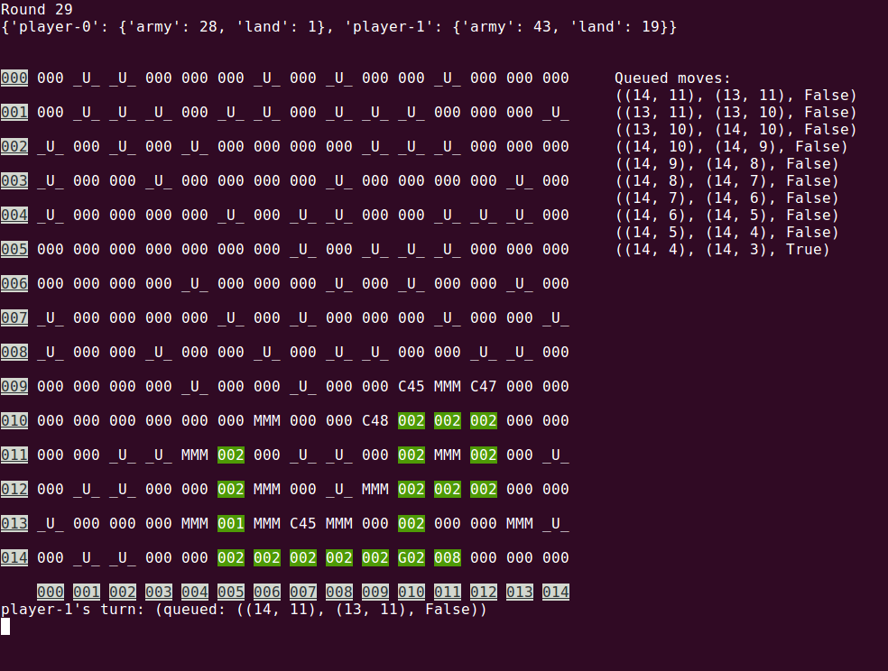

# A platform to test/build [generals](generals.io) playing algorithm

V0.0.0 release:
-----

* **Main Feature**: offline cli generals for up to 8 players

How to play:
-----
1. `git clone https://github.com/zfy0314/generals.git`
2. `cd generals`
3. create customized configure file in `configs/`, default provided as `configs/humans_2.yaml`
3. `python3 play.py --config_file={YOUR_CONFIG_FILE}`
4. type x y w/a/s/d/w1/a1/s1/d1 to control the army
    * x, y: initial coordinates
    * *1: move half of the army
    * add 'Q' to the front to quit all queued moves

------------
for developers:

Directory Tree
-----
```sh
--root/
|
|--base/
| |
| |--__init__.py
| |
| |--game.py # recreate generals
| |
| |--utils.py # some helper class/func
| |
| |--vis.py # visualize 
|
|--players/ # where different algorithms are stored
| |
| |--player_example/
| | |
| | |--__init__.py
| | |
| | |--player.py # the actual class to be called, should be inheritated from base_player
| | |
| | |--{OTHER_IMPLEMENTATION_CODES}
| |
| |--player_{OTHER}/
|
|--models/ # large models should be place here
| |
| |--model_example.{EXTENTION}
| |
| |--model_{OTHER}.{EXTENTION}
|
|--configs/ # different playing settings
| |
| |--{INDENTIFIER}.yaml
|
|--replays/ # save playing results, can be resumed
| |
| |--sample.yaml # sample half-played replay
| |
| |--{OTHER}.yaml
|
|--offline.py # v0.0.0 offline cli generals; merged into play.py; will be removed soon
|
|--play.py # main entrance, flag pointed to config file
|
|--requirements.txt # tracks python packages
|
|--README.md
|
|--test.py # a wrapper to test each module
```

Dos and Don'ts
-----
***DOs***
1. checkout new branches to implement new players
2. merge to {DATE}_dev
3. stash useless code before merging
4. try to be in line with requirements.txt e.g. package versions
5. try to keep player.py simple, place complex logic in other files
6. update README

***DO NOTs***
1. merge to master branch
2. edit other players
